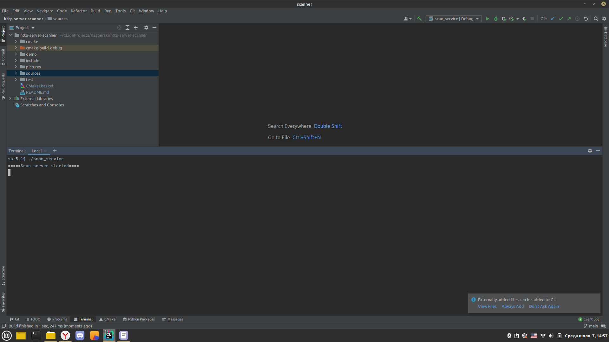
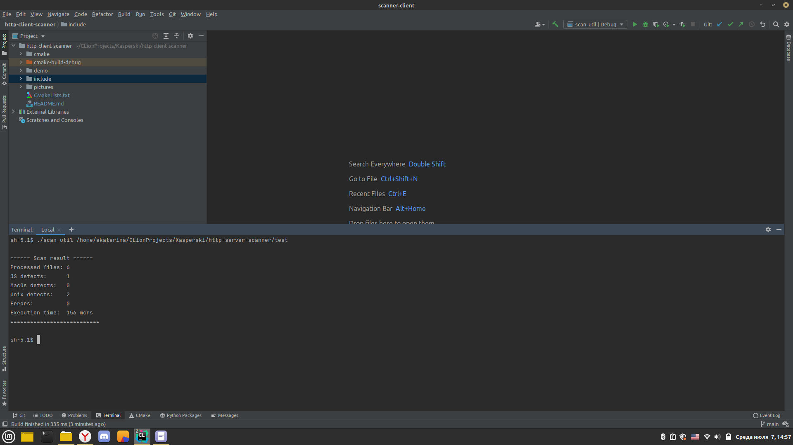

# http-server-scanner

Описание программы:

Сервисное приложение, ожидающее команд на сканирование файлов в директориях и выполняющее сканирование файлов в директориях, с целью нахождения подозрительных файлов. В качестве параметров передается путь к директории. Для реализации задания были использованы несколько библиотек boost, а также std::filesystem.

Based on: https://www.boost.org/doc/libs/1_66_0/libs/beast/example/http/server/sync/http_server_sync.cpp

Пример работы программы:
1. Запускаем сервер
 
2. Передаем путь к директории для сканирования и получаем ответ от сервера
 

